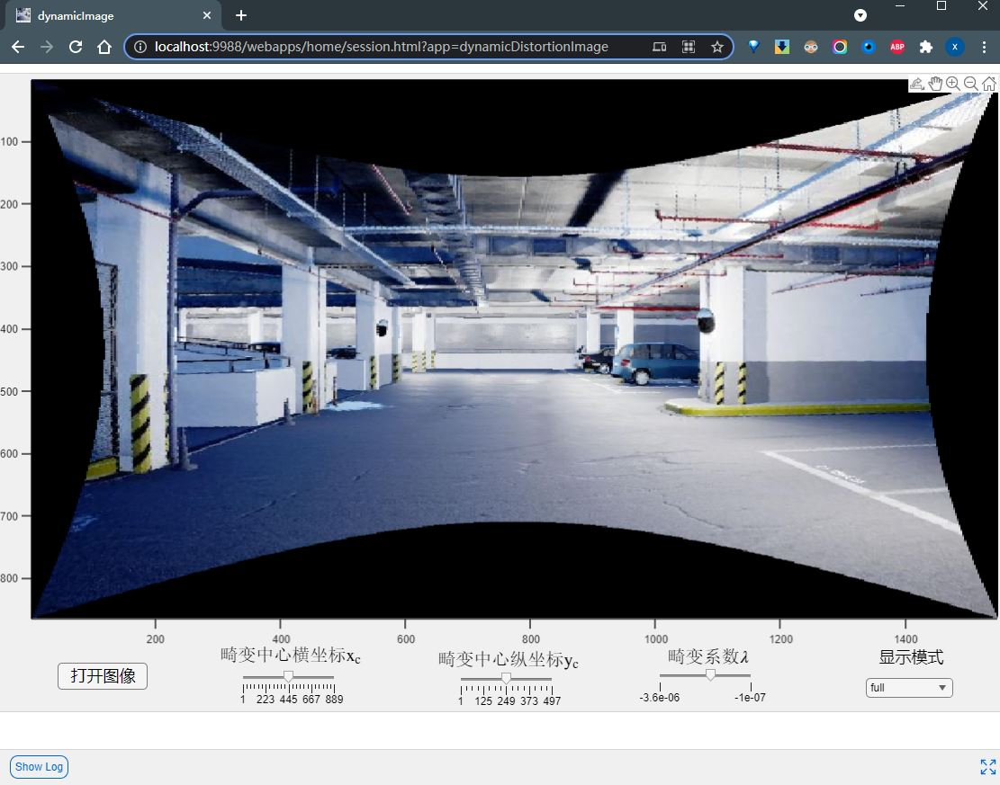
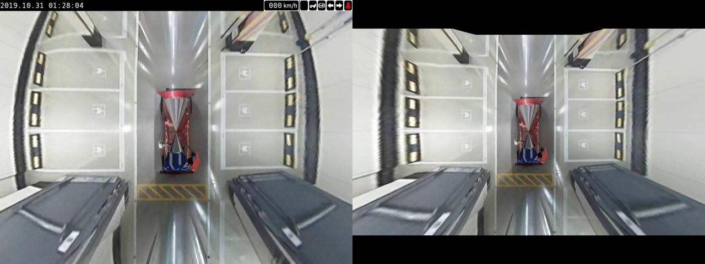
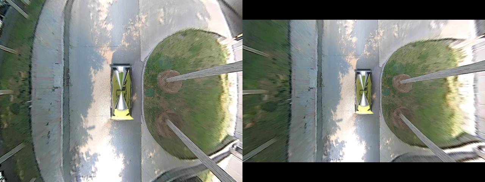
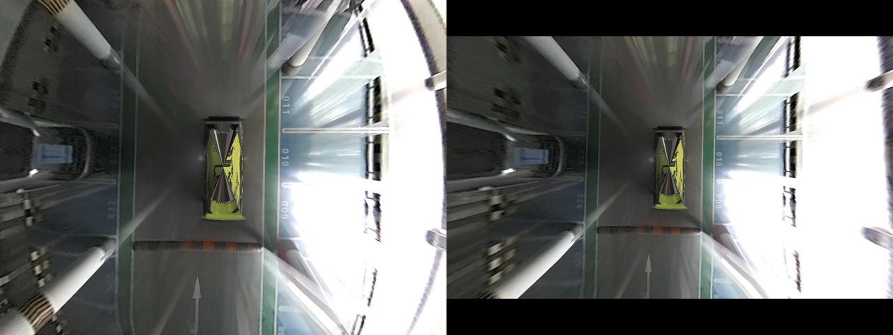
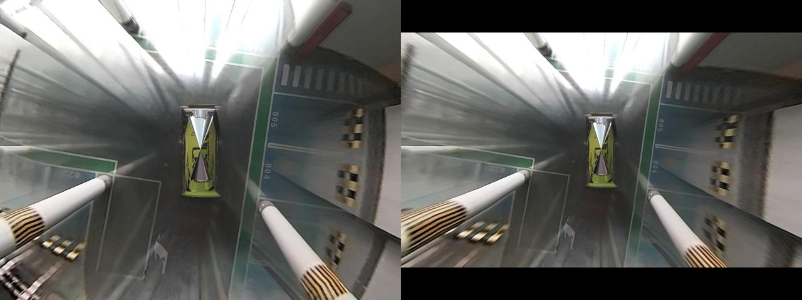
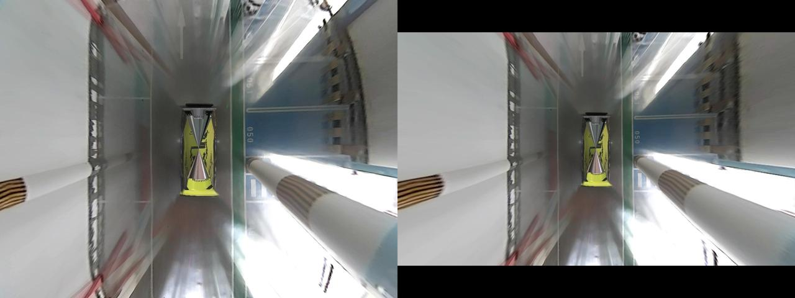

# 基于无标定方式的单张图像去畸变

本仓库旨在实现单幅畸变图像矫正的非典型方法，适用轻微畸变和严重畸变，部分具体理论和实践可以参考[此处pdf](./undistortFisheyeFromSingleView.pdf)。

## Requirements

MathWorks Products (<https://www.mathworks.com>)

- MATLAB 2022b or later
- Automated Driving Toolbox™
- Computer Vision Toolbox™
- Image Processing Toolbox™
- Optimization Toolbox™
- Symbolic Math Toolbox™

## 一些示例

- [普通广角/鱼眼镜头径向去畸变——除法模型动态调整实时求解](./demo_dynamicDistortCoff2.mlx)
- [非常规图像去畸变](./demo_geoImageWarp.mlx)
- [普通广角/鱼眼镜头径向畸变——除法模型逆变换代数求解](./demo_solve_inverse.mlx)
- [基于无需标定相机的方式直接对普通广角/超广角/鱼眼视频做BEV](./demo_undistortImage_BEV.mlx)
- [对去畸变后的图像建筑物"竖直倾斜"的直线进行矫正](./demo_undistortImage_perspective.mlx)
- [基于单系数除法模型对普通广角/鱼眼镜头图像去畸变实现](./demo_undistortImage_synthetic.mlx)

实现的方法根据**实际畸变图像有所不同**，大致分为以下两类。

## 1. 常规(常规意思指也可以通过标定板、厂家畸变表方式)图像去畸变

此类畸变可以通过[getArcs.mlapp](./getArcs.mlapp)交互程序获得图像中的弧线数据,然后通过[robustRectifyImage.m](./robustRectifyImage.m)函数鲁棒性去畸变。当然也可以实验性通过编程方式去畸变参考脚本示例程序[demo_undistortImage_synthetic.mlx](./demo_undistortImage_synthetic.mlx)，编程方式需要一些算法自动检测图像中的弧线。

***为了便于直观可视化效果，特地的制作了动态调整$(x_c,y_c,\lambda)$三个系数的方式对一幅畸变图像进行调整的过程，有兴趣且想尝鲜的朋友可以到[此处尝用](http://192.168.202.153:9988/webapps/home/session.html?app=dynamicDistortionImage)。*** <**此局域网web APP链接已失效，读者可以通过运行[getArcs.mlapp](./getArcs.mlapp)本地访问APP！**>

## 2. 非常规去畸变

此类畸变比较棘手，因为不满足通常意义上的畸变，**即使通过常规标定板方式矫正去畸变也达不到较好效果**。故只能从某种几何意义上估算其畸变模型，正向和逆向公式得靠自估，一些示例性的程序脚本见[demo_geoImageWarp.mlx](./demo_geoImageWarp.mlx),可以输出`mapX`,`mapY`映射坐标.

为便于对比，左边展示为畸变原图，右边为对应去畸变效果图。

## References

[1] <https://github.com/subeeshvasu/Awesome-Image-Distortion-Correction>

[2] <https://github.com/ethz-asl/image_undistort>

[3] <https://discorpy.readthedocs.io/en/latest/usage/demo_08.html#fig-75>
