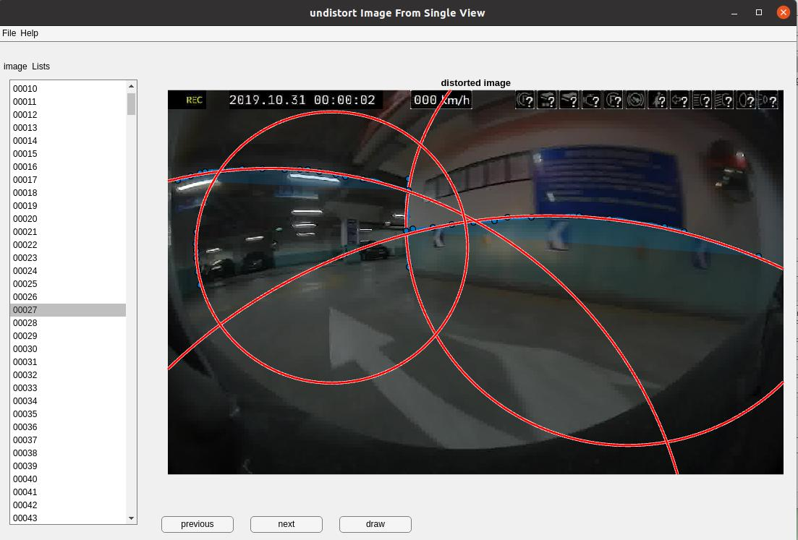

# 普通广角/鱼眼镜头模型仅从单幅图像上去畸变

崔星星 2023.5.12 首次记录

Email: <cuixingxing150@gmail.com>

> 在实际现实情况中，我们往往会遇到不方便标定、未知的镜头畸变参数、无畸变映射表格等的情况下，如何仅仅着手对当前的畸变图像进行去畸变？或者在自动驾驶任务中车载摄像头不断获取的畸变图像如何全自动在线去畸变矫正？本篇文章提供一种方式完成单幅图像的去畸变，**仅根据空间中存在的若干条直线在畸变图像中表现为弧线的先验即可，无需任何3D-2D空间点对应及摄像机内外参数**。此次开发结合多篇论文思想+结合最小区域法逆向评估方法较为鲁棒的实现了整个算法流程，并成功开发了交互式APP，在仿真图像和我们实际场景图像上均得到了有效验证，具有一定实际意义！

众所周知，图像去畸变在非常多的视觉应用中都有需要，是一种非常基础的工作，传统上一般采用OpenCV/Matlab标定工具完成，方法也非常成熟，新手简单学习一下可以快速上手。镜头畸变从数学模型上来说，一般分为多项式模型和除法模型，OpenCV/Matlab等工具使用的是多项式模型，但本技术采用除法模型，具体科普基础请**认真阅读本文后[References](#references)文献，本文假定你具有一定基础**。相对于多项式模型，其优点在于：**只有一个畸变系数、逆向变换可从数学角度去分析求解、微小畸变到严重畸变均适用、可直接从图片中的“直线”信息同时估计出畸变系数和畸变中心**，这也是最大的优势所在。以下公式表达准确，代码运行可靠，严格执行算法流程。

## 数学模型

简单回顾一下两种模型：

- 多项式模型( Brown-Conrady)

$$
\begin{equation}
\left\{\begin{matrix}
 x_u = x_d+(x_d-x_c)(K_1r_d^2+K_2r_d^4+...)+(P_1(r_d^2+2(x_d-x_c)^2)+2P_2(x_d-x_c)(y_d-y_c))(1+P_3r_d^2+P_4r_d^4+...) \\
 y_u = y_d+(y_d-y_c)(K_1r_d^2+K_2r_d^4+...)+(P_1(r_d^2+2(y_d-y_c)^2)+2P_2(x_d-x_c)(y_d-y_c))(1+P_3r_d^2+P_4r_d^4+...)
\end{matrix}\right.
\end{equation}
$$

式中：
$(x_d,y_d)$畸变图像上的像素点坐标；<br>
$(x_u,y_u)$无畸变图像(完美针孔相机)上的像素点坐标；<br>
$(x_c,y_c)$畸变中心；<br>
$K_n$第$n$个径向畸变系数;<br>
$P_n$第$n$个切向畸变系数；<br>
$r_d=\sqrt{(x_d-x_c)^2+(y_d-y_c)^2}$畸变图像点到畸变中心的欧式距离。<br>

- 除法模型(Fitzgibbon)

$$
\begin{equation}
\left\{\begin{matrix}
 x_u = x_c+\frac{x_d-x_c}{1+K_1r_d^2+K_2r_d^4+...}  \\
 y_u = y_c+\frac{y_d-x_c}{1+K_1r_d^2+K_2r_d^4+...}
\end{matrix}\right.
\end{equation}
$$

式中符号意义同上，使用此模型特别是遇到严重畸变的图像比多项式模型更具有较高的精度而且使用的项数较少，通常情况下，只使用一项$ K_1 $近似就足以能够满足绝大多数相机镜头。
特别地，当使用一项$ K_1 $时，从数学上可以分析求解得到逆变换的解析解：

$$
\begin{equation}
\left\{\begin{matrix}
 x_d = x_c+\frac{x_u-x_c}{2K_1r_u^2}(1-\sqrt{1-4K_1r_u^2})  \\
 y_d = y_c+\frac{y_u-y_c}{2K_1r_u^2}(1-\sqrt{1-4K_1r_u^2})
\end{matrix}\right.
\end{equation}
$$

式中：
$ r_u=\sqrt{(x_u-x_c)^2+(y_u-y_c)^2} $无畸变图像点到畸变中心或无畸变中心的欧式距离；其他符号意义同上。

## 如何根据“畸变直线”估计求解畸变系数和中心？

为便于分析计算，使用上述除法模型的一项近似，有：
$$
\begin{equation}
\left\{\begin{matrix}
 x_u = x_c+\frac{x_d-x_c}{1+K_1r_d^2}  \\
 y_u = y_c+\frac{y_d-x_c}{1+K_1r_d^2}
\end{matrix}\right.
\end{equation}
$$
对于无畸变图像上的任意直线方程的通式可表达为：
$$
\begin{equation}
\left\{\begin{matrix}
 ax_u+by_u+c=0 \\
 a^2+b^2+c^2=1
\end{matrix}\right.
\end{equation}
$$
实际上上述方程只有2个独立变量，故不妨约束系数$(a,b,c)$的模为1.

然后，式(4)带入式(5)，为避免重复推导，直接引用文献[2]的公式，可得到如下形式方程：
$$
\begin{equation}
x_d^2+y_d^2+Ax_d+By_d+C=0
\end{equation}
$$
$$
\begin{equation}
x_0^2+y_0^2+Ax_0+By_0+C=\frac{1}{\lambda}
\end{equation}
$$
注意：式(4)中的$(x_0,y_0)$对应上述中的$(x_c,y_c)$，$\lambda$对应上述的$K_1$。
我们可以看出，式(6)即为二维平面上圆的方程，通过畸变点可以拟合出一组圆弧的系数$[A,B,C]$,但为了求式（7）中的畸变中心$(x_0,y_0)$和畸变系数$\lambda$，共3个未知参数，至少需要3个独立的方程求解，即需要至少3组$[A,B,C]$,对应3组圆弧即可求解。求解公式为：

$$
\begin{equation}
\left\{\begin{matrix}
 (A_i-A_j)x_0 +(B_i-B_j)y_0+(C_i-C_j)=0  \\
(A_i-A_k)x_0 +(B_i-B_k)y_0+(C_i-C_k)=0 \\
(A_j-A_k)x_0 +(B_j-B_k)y_0+(C_j-C_k)=0
\end{matrix}\right.
\end{equation}
$$
畸变中心$(x_0,y_0)$求解出来后，带入式(7)，可求出畸变系数$\lambda$,完毕。

## 图像如何去畸变？

上述求解出畸变中心$(x_0,y_0)$，畸变系数$\lambda$后，最后一步就可以直接矫正了。通过式(3)可以求解到非畸变点到畸变点的映射关系，进一步，人为可以设定是否保留可视边界范围和缩放系数，随后通过双线性插值或者最近邻算法均可矫正所有像素，即可恢复整幅图像。

## 鲁棒性去伪评估策略

传统上一般使用RANSAC算法或者改进算法进行鲁棒估计，或者无畸变点到拟合“直线”的误差平方和作为评估代价函数，本文章为进一步提高评估质量，以最小区域法则进行逆向评估直线度，两包络无畸变点的平行直线$l1:ax+by+c=0$，$l2:ax+by+d=0$，其评估公式如下:
$$
\begin{equation}
\begin{split}
&\varepsilon = \mathop{\arg\min}\limits_{a,b,c,c,d}(\frac{\lvert c-d \rvert}{\sqrt{a^2+b^2}})\\
&s.t.\quad  \left\{\begin{array}{lc}
(ax_i+by_i+c)(ax_i+by_i+d)\leq0\\
 a^2+b^2+c^2=1\\
\end{array}\right.
\end{split}
\end{equation}
$$
上式优化属于典型的求解多元变量非线性约束优化问题，使用“interior-Point Algorithm”求解即可,对大规模数据集有较快的速度，必要时候可以提供一阶/二阶导数支持。

- 求满足上述条件的$l1$,$l2$平行线示例

```matlab
numPts = 300;% 随机产生300个二维点
maxNumX = 100;% 点集中产生横坐标x最大为100，默认最小为0
x = randi(maxNumX,numPts,1);
y = -x+50*rand(numPts,1);
[val,coeff,exitflag] = straightNess([x,y]);% 直线度评估函数

% 绘制结果显示
figure;scatter(x,y,20,"blue","filled");hold on;
x_ = 1:maxNumX;
y1 = (-coeff(3)-coeff(1).*x_)./coeff(2);% 直线l1
y2 = (-coeff(4)-coeff(1).*x_)./coeff(2);% 直线l2
grid on;plot(x_,y1,x_,y2,LineWidth=2)
legend(["samples","bounds1","bounds2"])
title("straightness:"+string(val))
```


## 如何实现

对于畸变图像中富有较多“直线”信息的弧线可以较为鲁棒的估计参数并去畸变，但若图像中“直线”数目较少或者没有，那么还可以通过同种镜头下不同图像的“直线”合并一起估计参数，这样一样可以较为鲁棒估计，整个实现主要分为两步骤。

### A.鲁棒的最小二乘拟合圆

比如下面仿真程序充分论证了鲁棒性的拟合了圆弧样本点，从图中可以看出，如果点有噪音偏差，最小二乘法拟合有较大的偏差。实际中点集来源于“直线”上的点，无论是交互式绘制“直线”还是其他自动算法检测“直线”，均有可能带入误差。

```matlab
%% robust least squre fit circle,just run this demo
% author:cuixingxing

%% Create randome points along a circle
r = 1;% 理论圆半径
numPts = 100; % 随机产生100个点
theta = linspace(0,2*pi,numPts);
xdata = r*cos(theta)+0.1*randn(1,numPts);
ydata = r*sin(theta)+0.1*randn(1,numPts);

% add noise
xdata(1) = 5;xdata(2) = 4;xdata(3) = 5;
ydata(1) = 4;ydata(2) = 5;ydata(3) = 5;
h1 = scatter(xdata,ydata); % sample data

% noise least square fit circle
fun = @(x)(xdata-x(1)).^2+(ydata-x(2)).^2-x(3).^2;
x = lsqnonlin(fun,[0,0,1]);

h2 = viscircles(x(1:2),x(3),color="red");hold on; % noise least square fit
h3 = viscircles([0,0],1,color="blue");% ground truth

%% robust fit
fitFcn = @(points)robustLeastSquareCircle(points);
distFcn = @(model, points)((points(:,1)-model(1)).^2+(points(:,2)-model(2)).^2-model(3).^2).^2;
sampleSize = 3;
maxDistance = 0.5;
data = [xdata(:),ydata(:)];

[modelRansac,inlierIdx] = ransac(data,fitFcn,distFcn,sampleSize,maxDistance);
h4 = viscircles(modelRansac(1:2),modelRansac(3),color="black");

modelRobust = fitFcn(data(inlierIdx,:));
h5 = viscircles(modelRobust(1:2),modelRobust(3),color="green");% robust fit'

legend([h1,h2,h3,h4,h5],{'point samples','least square fit','ground truth','Ransac samples fit','robust fit'},Location="northwest")
grid on;axis equal
```

鲁棒拟和圆示例图


### B.估计畸变中心和系数

此部分以流程图表达较好：


---
通过以上A,B两个步骤后，除了得到当前的去畸变图像，我们可选还可以得到映射表mapX,mapY,进而可以在任何需要用的地方直接进行映射使用，无需再进行上述步骤逐一去畸变。

## Results

下面展示了一些仿真图像和实际场景图像去畸变的示例，使用自定义开发交互的APP可以快速找到合适的“直线”，通过在物体周围绘制边界曲线，算法会将曲线自动吸附到边界并绘制以预览(红色圆弧)，一旦内部满足条件，界面会自动展示去畸变效果图像，不满意则可以绘制更多的潜在“直线”，以期达到去畸变效果。

- 仿真图像去畸变


- 实际地下停车场图像去畸变



由于上述典型图像畸变量较大，如果以不损失全部像素"full"模式，矫正后的图像特别大(图像宽高上万像素)，故上述显示以畸变中心的同原始图像一样大小输出的"same"模式，下图展示略微畸变的"full"模式的去畸变效果。
<table>
    <tr>
        <td ><center> distorted Image </center> </td>
        <td ><center> undistorted Image(full view) </center></td>
    </tr>

</table>

## 一些思考

本技术虽然基于畸变图像中潜在的多条“直线”特征信息完成了去畸变，此时的图像可以当做完美针孔相机所拍摄的图像。但是另外根据[2022年8月份个人开源的仓库](https://github.com/cuixing158/single-Image-Calibration)(仅从单幅针孔图像估计相机内外参)，如果此针孔图像中能找到至少3对（或者2对，此时相机主点假设在图像中心）正交的“消失线”，则可估计对应针孔图像相机的内参矩阵$K_{3\times3}$，如果还已知此针孔图像中某些物体的具体物理尺寸（比如宽或者高），则还可以进一步估计出相机的外参矩阵$[R_{3\times3},t_{3\times1}]$。

---
如有对本技术有疑问或者任何相关问题，均可探讨学习~

## References

[1] <https://wiki2.org/en/Distortion_(optics)>

[2] Wang, A., Qiu, T., Shao, L.: A simple method of radial distortion correction with centre of distortion estimation. Journal of Mathematical Imaging and Vision 35 (2009) 165–172

[3] Bukhari, F., Dailey, M.N. (2010). Robust Radial Distortion from a Single Image. In: , et al. Advances in Visual Computing. ISVC 2010. Lecture Notes in Computer Science, vol 6454. Springer, Berlin, Heidelberg. <https://doi.org/10.1007/978-3-642-17274-8_2>

[4] L. Zhang, H. Shang, F. Wu, R. Wang, T. Sun and J. Xie, "Robust Line-Based Radial Distortion Estimation From a Single Image," in IEEE Access, vol. 7, pp. 180373-180382, 2019, doi: 10.1109/ACCESS.2019.2959204.

[5] Richard Hartley, Sing Bing Kang MSR-TR-2005-42 | April 2005:Parameter-free Radial Distortion Correction with Centre of Distortion Estimation.

[6] [Henri P. Gavin: The Levenberg-Marquardt algorithm for nonlinear least squares curve-fitting problems,November 27, 2022](https://people.duke.edu/~hpgavin/ExperimentalSystems/lm.pdf)
